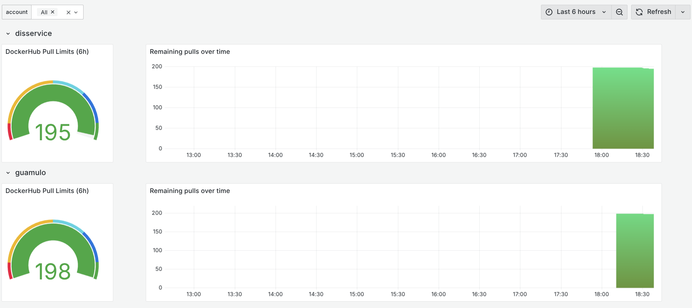

# A prometheus exporter to monitor your DockerHub limits

DockerHub is now rate-limiting image pulls. This is a simple prometheus 
exporter that will help you monitor your DockerHub limits.

You can read more about this in [dev.to](https://dev.to/jadolg/monitoring-docker-hub-limits-with-prometheus-1647)

## Usage

### Create a config file
Create a `config.yaml` file. Feel free to copy from `config.example.yaml` and modify it to your needs.

### Run the exporter

#### Using Docker

```bash
docker run --rm \
  -v $PWD/config.yaml:/config.yaml \
  -p 9101:9101 \
  -it ghcr.io/jadolg/dockerhub-pull-limit-exporter
```

#### Using Docker Compose

```yaml
services:
  dockerhub-pull-limit-exporter:
    image: ghcr.io/jadolg/dockerhub-pull-limit-exporter
    restart: unless-stopped
    ports:
      - 9101:9101
    volumes:
      - ./config.yaml:/config.yaml
```

## Available metrics
- The rate limit for DockerHub pulls: `dockerhub_pull_limit_total`
- The remaining DockerHub pulls: `dockerhub_pull_remaining_total`
- The time window in seconds to which the limit applies: `dockerhub_pull_limit_window_seconds`
- The time window in seconds to which the remaining pulls apply: `dockerhub_pull_remaining_window_seconds`
- Exporter errors: `dockerhub_pull_errors_total`

## Grafana Dashboard

Either import the JSON file from `grafana/` or use the following link to import it directly into Grafana: https://grafana.com/grafana/dashboards/23342-dockerhub-pull-limits/



## Example alerts

```yaml
groups:
  - name: DockerHubPullLimits
    rules:
      - alert: DockerHubPullsRemainingLow
        expr: dockerhub_pull_remaining_total/dockerhub_pull_limit_total * 100 < 10 
        for: 5m
        labels:
          severity: warning
        annotations:
          summary: "Account {{ $labels.account }} has used 90% of its pull limit"
      - alert: DockerHubPullsRemainingLowCritical
        expr: dockerhub_pull_remaining_total < 1
        for: 5m
        labels:
          severity: critical
        annotations:
          summary: "Account {{ $labels.account }} has used 100% of its pull limit"
      - alert: DockerHubLimitsExporterError
        expr: increase(dockerhub_pull_errors_total[5m]) > 0
        for: 5m
        labels:
          severity: warning
        annotations:
          summary: "The DockerHub limits exporter at {{ $labels.instance }} is experiencing errors"
```
